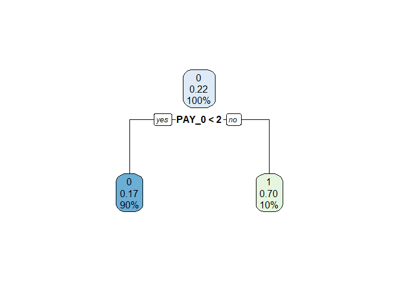
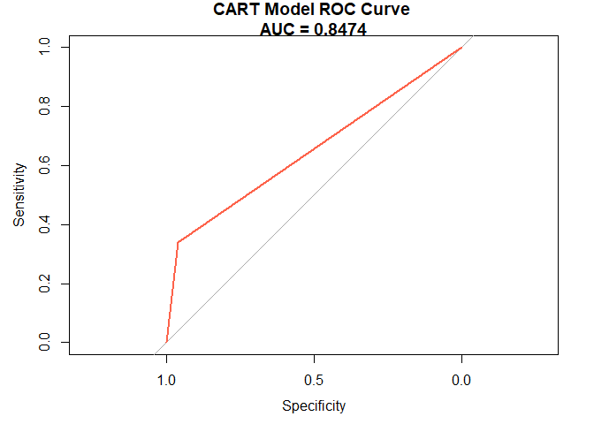

Ayudantía 11
================

### Librerias:

Cargamos las librerias que se utilizarán en este proyecto.

``` r
library(dplyr)
```

    ## Warning: package 'dplyr' was built under R version 4.0.5

    ## 
    ## Attaching package: 'dplyr'

    ## The following objects are masked from 'package:stats':
    ## 
    ##     filter, lag

    ## The following objects are masked from 'package:base':
    ## 
    ##     intersect, setdiff, setequal, union

``` r
#library (tidyverse)
library (ggplot2)
```

    ## Warning: package 'ggplot2' was built under R version 4.0.5

``` r
library(datasets)
library(pROC)
```

    ## Warning: package 'pROC' was built under R version 4.0.5

    ## Type 'citation("pROC")' for a citation.

    ## 
    ## Attaching package: 'pROC'

    ## The following objects are masked from 'package:stats':
    ## 
    ##     cov, smooth, var

``` r
library(discrim)
```

    ## Warning: package 'discrim' was built under R version 4.0.5

    ## Loading required package: parsnip

    ## Warning: package 'parsnip' was built under R version 4.0.5

``` r
library(plyr)
```

    ## Warning: package 'plyr' was built under R version 4.0.3

    ## ------------------------------------------------------------------------------

    ## You have loaded plyr after dplyr - this is likely to cause problems.
    ## If you need functions from both plyr and dplyr, please load plyr first, then dplyr:
    ## library(plyr); library(dplyr)

    ## ------------------------------------------------------------------------------

    ## 
    ## Attaching package: 'plyr'

    ## The following objects are masked from 'package:dplyr':
    ## 
    ##     arrange, count, desc, failwith, id, mutate, rename, summarise,
    ##     summarize

``` r
library(caret)
```

    ## Warning: package 'caret' was built under R version 4.0.5

    ## Loading required package: lattice

``` r
library(tidymodels)
```

    ## Warning: package 'tidymodels' was built under R version 4.0.5

    ## Registered S3 method overwritten by 'tune':
    ##   method                   from   
    ##   required_pkgs.model_spec parsnip

    ## -- Attaching packages -------------------------------------- tidymodels 0.1.3 --

    ## v broom        0.7.7      v tibble       3.1.2 
    ## v dials        0.0.9      v tidyr        1.1.3 
    ## v infer        0.5.4      v tune         0.1.5 
    ## v modeldata    0.1.0      v workflows    0.2.2 
    ## v purrr        0.3.4      v workflowsets 0.0.2 
    ## v recipes      0.1.16     v yardstick    0.0.8 
    ## v rsample      0.1.0

    ## Warning: package 'broom' was built under R version 4.0.5

    ## Warning: package 'dials' was built under R version 4.0.5

    ## Warning: package 'infer' was built under R version 4.0.5

    ## Warning: package 'modeldata' was built under R version 4.0.5

    ## Warning: package 'recipes' was built under R version 4.0.5

    ## Warning: package 'rsample' was built under R version 4.0.5

    ## Warning: package 'tibble' was built under R version 4.0.5

    ## Warning: package 'tidyr' was built under R version 4.0.5

    ## Warning: package 'tune' was built under R version 4.0.5

    ## Warning: package 'workflows' was built under R version 4.0.5

    ## Warning: package 'workflowsets' was built under R version 4.0.5

    ## Warning: package 'yardstick' was built under R version 4.0.5

    ## -- Conflicts ----------------------------------------- tidymodels_conflicts() --
    ## x plyr::arrange()          masks dplyr::arrange()
    ## x purrr::compact()         masks plyr::compact()
    ## x plyr::count()            masks dplyr::count()
    ## x purrr::discard()         masks scales::discard()
    ## x plyr::failwith()         masks dplyr::failwith()
    ## x dplyr::filter()          masks stats::filter()
    ## x plyr::id()               masks dplyr::id()
    ## x dplyr::lag()             masks stats::lag()
    ## x purrr::lift()            masks caret::lift()
    ## x plyr::mutate()           masks dplyr::mutate()
    ## x yardstick::precision()   masks caret::precision()
    ## x yardstick::recall()      masks caret::recall()
    ## x plyr::rename()           masks dplyr::rename()
    ## x yardstick::sensitivity() masks caret::sensitivity()
    ## x yardstick::specificity() masks caret::specificity()
    ## x recipes::step()          masks stats::step()
    ## x plyr::summarise()        masks dplyr::summarise()
    ## x plyr::summarize()        masks dplyr::summarize()
    ## * Use tidymodels_prefer() to resolve common conflicts.

### Cargamos la data:

``` r
data = read.csv(file.choose())
summary(data)
```

    ##        ID          LIMIT_BAL            SEX          EDUCATION    
    ##  Min.   :    1   Min.   :  10000   Min.   :1.000   Min.   :0.000  
    ##  1st Qu.: 7501   1st Qu.:  50000   1st Qu.:1.000   1st Qu.:1.000  
    ##  Median :15000   Median : 140000   Median :2.000   Median :2.000  
    ##  Mean   :15000   Mean   : 167484   Mean   :1.604   Mean   :1.853  
    ##  3rd Qu.:22500   3rd Qu.: 240000   3rd Qu.:2.000   3rd Qu.:2.000  
    ##  Max.   :30000   Max.   :1000000   Max.   :2.000   Max.   :6.000  
    ##     MARRIAGE          AGE            PAY_0             PAY_2        
    ##  Min.   :0.000   Min.   :21.00   Min.   :-2.0000   Min.   :-2.0000  
    ##  1st Qu.:1.000   1st Qu.:28.00   1st Qu.:-1.0000   1st Qu.:-1.0000  
    ##  Median :2.000   Median :34.00   Median : 0.0000   Median : 0.0000  
    ##  Mean   :1.552   Mean   :35.49   Mean   :-0.0167   Mean   :-0.1338  
    ##  3rd Qu.:2.000   3rd Qu.:41.00   3rd Qu.: 0.0000   3rd Qu.: 0.0000  
    ##  Max.   :3.000   Max.   :79.00   Max.   : 8.0000   Max.   : 8.0000  
    ##      PAY_3             PAY_4             PAY_5             PAY_6        
    ##  Min.   :-2.0000   Min.   :-2.0000   Min.   :-2.0000   Min.   :-2.0000  
    ##  1st Qu.:-1.0000   1st Qu.:-1.0000   1st Qu.:-1.0000   1st Qu.:-1.0000  
    ##  Median : 0.0000   Median : 0.0000   Median : 0.0000   Median : 0.0000  
    ##  Mean   :-0.1662   Mean   :-0.2207   Mean   :-0.2662   Mean   :-0.2911  
    ##  3rd Qu.: 0.0000   3rd Qu.: 0.0000   3rd Qu.: 0.0000   3rd Qu.: 0.0000  
    ##  Max.   : 8.0000   Max.   : 8.0000   Max.   : 8.0000   Max.   : 8.0000  
    ##    BILL_AMT1         BILL_AMT2        BILL_AMT3         BILL_AMT4      
    ##  Min.   :-165580   Min.   :-69777   Min.   :-157264   Min.   :-170000  
    ##  1st Qu.:   3559   1st Qu.:  2985   1st Qu.:   2666   1st Qu.:   2327  
    ##  Median :  22382   Median : 21200   Median :  20089   Median :  19052  
    ##  Mean   :  51223   Mean   : 49179   Mean   :  47013   Mean   :  43263  
    ##  3rd Qu.:  67091   3rd Qu.: 64006   3rd Qu.:  60165   3rd Qu.:  54506  
    ##  Max.   : 964511   Max.   :983931   Max.   :1664089   Max.   : 891586  
    ##    BILL_AMT5        BILL_AMT6          PAY_AMT1         PAY_AMT2      
    ##  Min.   :-81334   Min.   :-339603   Min.   :     0   Min.   :      0  
    ##  1st Qu.:  1763   1st Qu.:   1256   1st Qu.:  1000   1st Qu.:    833  
    ##  Median : 18105   Median :  17071   Median :  2100   Median :   2009  
    ##  Mean   : 40311   Mean   :  38872   Mean   :  5664   Mean   :   5921  
    ##  3rd Qu.: 50191   3rd Qu.:  49198   3rd Qu.:  5006   3rd Qu.:   5000  
    ##  Max.   :927171   Max.   : 961664   Max.   :873552   Max.   :1684259  
    ##     PAY_AMT3         PAY_AMT4         PAY_AMT5           PAY_AMT6       
    ##  Min.   :     0   Min.   :     0   Min.   :     0.0   Min.   :     0.0  
    ##  1st Qu.:   390   1st Qu.:   296   1st Qu.:   252.5   1st Qu.:   117.8  
    ##  Median :  1800   Median :  1500   Median :  1500.0   Median :  1500.0  
    ##  Mean   :  5226   Mean   :  4826   Mean   :  4799.4   Mean   :  5215.5  
    ##  3rd Qu.:  4505   3rd Qu.:  4013   3rd Qu.:  4031.5   3rd Qu.:  4000.0  
    ##  Max.   :896040   Max.   :621000   Max.   :426529.0   Max.   :528666.0  
    ##  default.payment.next.month
    ##  Min.   :0.0000            
    ##  1st Qu.:0.0000            
    ##  Median :0.0000            
    ##  Mean   :0.2212            
    ##  3rd Qu.:0.0000            
    ##  Max.   :1.0000

Limpiamos valores Nulos de la base de datos:

``` r
sapply(data, function(x)sum(is.na(x)))
```

    ##                         ID                  LIMIT_BAL 
    ##                          0                          0 
    ##                        SEX                  EDUCATION 
    ##                          0                          0 
    ##                   MARRIAGE                        AGE 
    ##                          0                          0 
    ##                      PAY_0                      PAY_2 
    ##                          0                          0 
    ##                      PAY_3                      PAY_4 
    ##                          0                          0 
    ##                      PAY_5                      PAY_6 
    ##                          0                          0 
    ##                  BILL_AMT1                  BILL_AMT2 
    ##                          0                          0 
    ##                  BILL_AMT3                  BILL_AMT4 
    ##                          0                          0 
    ##                  BILL_AMT5                  BILL_AMT6 
    ##                          0                          0 
    ##                   PAY_AMT1                   PAY_AMT2 
    ##                          0                          0 
    ##                   PAY_AMT3                   PAY_AMT4 
    ##                          0                          0 
    ##                   PAY_AMT5                   PAY_AMT6 
    ##                          0                          0 
    ## default.payment.next.month 
    ##                          0

``` r
data_limpia=na.omit(data)
```

Analizamos las variables y su tipo y corregimos.

``` r
str(data_limpia)
```

    ## 'data.frame':    30000 obs. of  25 variables:
    ##  $ ID                        : int  1 2 3 4 5 6 7 8 9 10 ...
    ##  $ LIMIT_BAL                 : num  20000 120000 90000 50000 50000 50000 500000 100000 140000 20000 ...
    ##  $ SEX                       : int  2 2 2 2 1 1 1 2 2 1 ...
    ##  $ EDUCATION                 : int  2 2 2 2 2 1 1 2 3 3 ...
    ##  $ MARRIAGE                  : int  1 2 2 1 1 2 2 2 1 2 ...
    ##  $ AGE                       : int  24 26 34 37 57 37 29 23 28 35 ...
    ##  $ PAY_0                     : int  2 -1 0 0 -1 0 0 0 0 -2 ...
    ##  $ PAY_2                     : int  2 2 0 0 0 0 0 -1 0 -2 ...
    ##  $ PAY_3                     : int  -1 0 0 0 -1 0 0 -1 2 -2 ...
    ##  $ PAY_4                     : int  -1 0 0 0 0 0 0 0 0 -2 ...
    ##  $ PAY_5                     : int  -2 0 0 0 0 0 0 0 0 -1 ...
    ##  $ PAY_6                     : int  -2 2 0 0 0 0 0 -1 0 -1 ...
    ##  $ BILL_AMT1                 : num  3913 2682 29239 46990 8617 ...
    ##  $ BILL_AMT2                 : num  3102 1725 14027 48233 5670 ...
    ##  $ BILL_AMT3                 : num  689 2682 13559 49291 35835 ...
    ##  $ BILL_AMT4                 : num  0 3272 14331 28314 20940 ...
    ##  $ BILL_AMT5                 : num  0 3455 14948 28959 19146 ...
    ##  $ BILL_AMT6                 : num  0 3261 15549 29547 19131 ...
    ##  $ PAY_AMT1                  : num  0 0 1518 2000 2000 ...
    ##  $ PAY_AMT2                  : num  689 1000 1500 2019 36681 ...
    ##  $ PAY_AMT3                  : num  0 1000 1000 1200 10000 657 38000 0 432 0 ...
    ##  $ PAY_AMT4                  : num  0 1000 1000 1100 9000 ...
    ##  $ PAY_AMT5                  : num  0 0 1000 1069 689 ...
    ##  $ PAY_AMT6                  : num  0 2000 5000 1000 679 ...
    ##  $ default.payment.next.month: int  1 1 0 0 0 0 0 0 0 0 ...

``` r
data_limpia=mutate(data_limpia, default.payment.next.month=as.factor(default.payment.next.month), SEX=as.factor(SEX), MARRIAGE=as.factor(MARRIAGE), EDUCATION=as.factor(EDUCATION))
str(data_limpia)
```

    ## 'data.frame':    30000 obs. of  25 variables:
    ##  $ ID                        : int  1 2 3 4 5 6 7 8 9 10 ...
    ##  $ LIMIT_BAL                 : num  20000 120000 90000 50000 50000 50000 500000 100000 140000 20000 ...
    ##  $ SEX                       : Factor w/ 2 levels "1","2": 2 2 2 2 1 1 1 2 2 1 ...
    ##  $ EDUCATION                 : Factor w/ 7 levels "0","1","2","3",..: 3 3 3 3 3 2 2 3 4 4 ...
    ##  $ MARRIAGE                  : Factor w/ 4 levels "0","1","2","3": 2 3 3 2 2 3 3 3 2 3 ...
    ##  $ AGE                       : int  24 26 34 37 57 37 29 23 28 35 ...
    ##  $ PAY_0                     : int  2 -1 0 0 -1 0 0 0 0 -2 ...
    ##  $ PAY_2                     : int  2 2 0 0 0 0 0 -1 0 -2 ...
    ##  $ PAY_3                     : int  -1 0 0 0 -1 0 0 -1 2 -2 ...
    ##  $ PAY_4                     : int  -1 0 0 0 0 0 0 0 0 -2 ...
    ##  $ PAY_5                     : int  -2 0 0 0 0 0 0 0 0 -1 ...
    ##  $ PAY_6                     : int  -2 2 0 0 0 0 0 -1 0 -1 ...
    ##  $ BILL_AMT1                 : num  3913 2682 29239 46990 8617 ...
    ##  $ BILL_AMT2                 : num  3102 1725 14027 48233 5670 ...
    ##  $ BILL_AMT3                 : num  689 2682 13559 49291 35835 ...
    ##  $ BILL_AMT4                 : num  0 3272 14331 28314 20940 ...
    ##  $ BILL_AMT5                 : num  0 3455 14948 28959 19146 ...
    ##  $ BILL_AMT6                 : num  0 3261 15549 29547 19131 ...
    ##  $ PAY_AMT1                  : num  0 0 1518 2000 2000 ...
    ##  $ PAY_AMT2                  : num  689 1000 1500 2019 36681 ...
    ##  $ PAY_AMT3                  : num  0 1000 1000 1200 10000 657 38000 0 432 0 ...
    ##  $ PAY_AMT4                  : num  0 1000 1000 1100 9000 ...
    ##  $ PAY_AMT5                  : num  0 0 1000 1069 689 ...
    ##  $ PAY_AMT6                  : num  0 2000 5000 1000 679 ...
    ##  $ default.payment.next.month: Factor w/ 2 levels "0","1": 2 2 1 1 1 1 1 1 1 1 ...

Hacemos cambios en variables que son de tipo factor. Nos enfocaremos en
predecir la variable “default.payment.next.month” la cuañ indica si el
cliente va a pagar o no el crédito que adeuda, con valores “0” y “1”.

## \#\# Aplicamos modelo “Arbol de desición”:

Creamos data de entrenamiento y de prueba para nuestro modelo.

``` r
data_split <- initial_split(data_limpia, prop = 0.8)

# Create data frames for the two sets:
train_data <- training(data_split) 
test_data <- testing(data_split)

str(train_data)
```

    ## 'data.frame':    24000 obs. of  25 variables:
    ##  $ ID                        : int  17488 7107 4670 16570 7454 28967 11172 4235 28270 919 ...
    ##  $ LIMIT_BAL                 : num  160000 310000 50000 50000 30000 180000 70000 260000 20000 240000 ...
    ##  $ SEX                       : Factor w/ 2 levels "1","2": 2 1 1 1 2 2 1 2 2 1 ...
    ##  $ EDUCATION                 : Factor w/ 7 levels "0","1","2","3",..: 4 2 3 3 2 3 3 2 3 2 ...
    ##  $ MARRIAGE                  : Factor w/ 4 levels "0","1","2","3": 3 2 2 3 2 3 2 3 2 3 ...
    ##  $ AGE                       : int  35 43 57 29 43 34 37 33 49 46 ...
    ##  $ PAY_0                     : int  0 -2 0 0 -1 0 0 -2 0 0 ...
    ##  $ PAY_2                     : int  0 -2 0 0 -1 0 0 -2 0 0 ...
    ##  $ PAY_3                     : int  0 -2 2 0 -1 0 0 -2 2 0 ...
    ##  $ PAY_4                     : int  0 -2 0 0 -2 0 2 -1 2 0 ...
    ##  $ PAY_5                     : int  0 -2 0 0 -2 0 2 0 0 0 ...
    ##  $ PAY_6                     : int  0 -2 0 0 -2 0 2 0 0 0 ...
    ##  $ BILL_AMT1                 : num  92509 0 25551 44177 390 ...
    ##  $ BILL_AMT2                 : num  88281 0 22957 44820 780 ...
    ##  $ BILL_AMT3                 : num  80435 0 18027 46022 0 ...
    ##  $ BILL_AMT4                 : num  79969 0 13836 46903 0 ...
    ##  $ BILL_AMT5                 : num  77108 0 14966 47837 0 ...
    ##  $ BILL_AMT6                 : num  76579 0 13220 48383 0 ...
    ##  $ PAY_AMT1                  : num  3472 0 2733 2070 780 ...
    ##  $ PAY_AMT2                  : num  3604 0 759 3000 0 ...
    ##  $ PAY_AMT3                  : num  2972 0 500 2000 0 ...
    ##  $ PAY_AMT4                  : num  3000 0 6326 2000 0 ...
    ##  $ PAY_AMT5                  : num  2228 0 3259 2000 0 ...
    ##  $ PAY_AMT6                  : num  2201 0 2281 2000 0 ...
    ##  $ default.payment.next.month: Factor w/ 2 levels "0","1": 1 1 2 1 1 1 2 1 2 1 ...

Creamos receta:

``` r
receta <- 
  recipe(default.payment.next.month ~ AGE+MARRIAGE+EDUCATION+SEX+ PAY_0+PAY_AMT1, data = train_data)

receta 
```

    ## Data Recipe
    ## 
    ## Inputs:
    ## 
    ##       role #variables
    ##    outcome          1
    ##  predictor          6

``` r
modelo_trees <-
  decision_tree(tree_depth = 5, min_n = 10) %>% 
  set_engine("rpart") %>% 
  set_mode("classification")

modelo_trees
```

    ## Decision Tree Model Specification (classification)
    ## 
    ## Main Arguments:
    ##   tree_depth = 5
    ##   min_n = 10
    ## 
    ## Computational engine: rpart

Ahora hacemos el fit del modelo:

``` r
modelo= decision_tree(tree_depth =  5,min_n=10) %>%
  set_engine("rpart") %>%set_mode("classification")
modelo
```

    ## Decision Tree Model Specification (classification)
    ## 
    ## Main Arguments:
    ##   tree_depth = 5
    ##   min_n = 10
    ## 
    ## Computational engine: rpart

``` r
fit_mod <- function(mod){
  
  modelo_fit <- 
  workflow() %>% 
  add_model(mod) %>% 
  add_recipe(receta) %>% 
  fit(data = train_data)

model_pred <- 
  predict(modelo_fit, test_data, type = "prob") %>% 
  bind_cols(test_data) 

return(model_pred %>% 
  roc_auc(truth= default.payment.next.month, .pred_0))
}

fit_mod(modelo)
```

    ## # A tibble: 1 x 3
    ##   .metric .estimator .estimate
    ##   <chr>   <chr>          <dbl>
    ## 1 roc_auc binary         0.648

Se hizo algunas pruebas cambiando variables y se obtuvo un valor AUC del
65% lo que no es el mejor valor

## Comparamos con otros modelos:

### Regresión Logística.

``` r
modelo_rl <- 
  logistic_reg() %>% 
  set_engine("glm")

fit_mod(modelo_rl)
```

    ## # A tibble: 1 x 3
    ##   .metric .estimator .estimate
    ##   <chr>   <chr>          <dbl>
    ## 1 roc_auc binary         0.715

En este caso la regresión logística arrojó un mejor porcentaje de
predicción con un 73%.

### Representación gráfica del Arbol:

``` r
library(rpart)
```

    ## Warning: package 'rpart' was built under R version 4.0.5

    ## 
    ## Attaching package: 'rpart'

    ## The following object is masked from 'package:dials':
    ## 
    ##     prune

``` r
library(rpart.plot)
```

    ## Warning: package 'rpart.plot' was built under R version 4.0.5

``` r
censo <- rpart(default.payment.next.month~AGE+MARRIAGE+EDUCATION+SEX+ PAY_0+PAY_AMT1, data = train_data, method = "class")

rpart.plot(censo)
```

<!-- -->

Se puede observar que la variable que mas toma peso en esta desición es
la variable PAY\_0 lo cual es bastante interesante descubrir.

### Predict:

``` r
pred <- predict(censo, newdata = test_data, type = "class")
pred %>% as.data.frame() %>% head()
```

    ##    .
    ## 3  0
    ## 6  0
    ## 13 0
    ## 16 0
    ## 19 0
    ## 20 0

``` r
test_data$pred <- pred
```

## Predict para curva ROC:

``` r
pred_incom_roc <- predict(censo, newdata = test_data, type = "prob")
pred_incom_roc %>% as.data.frame() %>% head()
```

    ##            0         1
    ## 3  0.8328373 0.1671627
    ## 6  0.8328373 0.1671627
    ## 13 0.8328373 0.1671627
    ## 16 0.8328373 0.1671627
    ## 19 0.8328373 0.1671627
    ## 20 0.8328373 0.1671627

``` r
pred_incom_roc <- pred_incom_roc %>% as.data.frame()
prob <- pred_incom_roc$"1"
```

## Evaluar modelo:

### Matriz de confusión:

``` r
cm <- confusionMatrix(table(test_data$default.payment.next.month, test_data$pred))
test_data$pred <- as.factor(test_data$pred)

table <- data.frame(confusionMatrix(test_data$default.payment.next.month, test_data$pred)$table)

print(cm)
```

    ## Confusion Matrix and Statistics
    ## 
    ##    
    ##        0    1
    ##   0 4500  195
    ##   1  864  441
    ##                                           
    ##                Accuracy : 0.8235          
    ##                  95% CI : (0.8136, 0.8331)
    ##     No Information Rate : 0.894           
    ##     P-Value [Acc > NIR] : 1               
    ##                                           
    ##                   Kappa : 0.3637          
    ##                                           
    ##  Mcnemar's Test P-Value : <2e-16          
    ##                                           
    ##             Sensitivity : 0.8389          
    ##             Specificity : 0.6934          
    ##          Pos Pred Value : 0.9585          
    ##          Neg Pred Value : 0.3379          
    ##              Prevalence : 0.8940          
    ##          Detection Rate : 0.7500          
    ##    Detection Prevalence : 0.7825          
    ##       Balanced Accuracy : 0.7662          
    ##                                           
    ##        'Positive' Class : 0               
    ## 

La matriz nos indica que se predijeron bien aproximadamente 5.000 datos
y por otra parte aproximadamente 900 datos fueron predichos de manera
erronea.

### Curva ROC:

``` r
ROC <- roc(test_data$default.payment.next.month,prob)
```

    ## Setting levels: control = 0, case = 1

    ## Setting direction: controls < cases

``` r
plot(ROC, col = "#fd634b", family = "sans", cex = 2, main = "CART Model ROC Curve 
AUC = 0.8474")
```

<!-- -->

### Chequeo de overfitting:

``` r
is_predicted<- predict(censo,newdata=train_data,type='class')
misClassError <- mean(is_predicted != train_data$default.payment.next.month)
print(paste('Train-set Accuracy =',1-misClassError))
```

    ## [1] "Train-set Accuracy = 0.818625"

``` r
misClassError <- mean(test_data$pred != test_data$default.payment.next.month)
print(paste('Test-set Accuracy =',1-misClassError))
```

    ## [1] "Test-set Accuracy = 0.8235"

Los valores no están muy alejados entre ellos por lo que no existe un
sobre entrenamiento.
